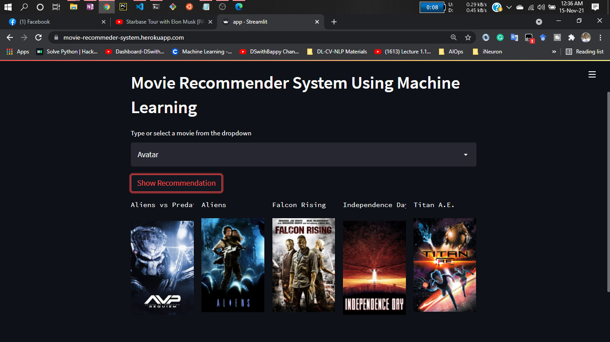

Here is the corrected version of your README file with improved grammar, spelling corrections, and enhanced clarity where needed:

---

# Project: Movie Recommender System Using Machine Learning!


Recommendation systems are becoming increasingly important in today’s fast-paced world. People are always short on time with the myriad tasks they need to accomplish in the limited 24 hours. Therefore, recommendation systems are essential as they help users make the right choices without having to expend significant cognitive resources.

The purpose of a recommendation system is to search for content that would be interesting to an individual. It involves a number of factors to create personalized lists of useful and interesting content specific to each user. Recommendation systems are Artificial Intelligence-based algorithms that skim through all possible options and create a customized list of items that are interesting and relevant to an individual. These results are based on their profile, search/browsing history, what other people with similar traits/demographics are watching, and how likely the individual is to watch those movies. This is achieved through predictive modeling and heuristics using the data available.

---

# Types of Recommendation Systems:

### 1) Content-Based:

- Content-based systems use characteristic information and consider item attributes.
- Examples: Twitter, YouTube.
- These systems recommend content based on what music you listen to or what singers you follow, forming embeddings for the features.
- Recommendations are based on user-specific actions or similar items.
- A vector representation of items is created.
- These systems hypothesize that if a user was interested in an item in the past, they will likely be interested in similar items in the future.
- **Issue**: They may provide overly obvious recommendations due to excessive specialization (e.g., if a user is only interested in categories B, C, and D, the system might fail to recommend items outside those categories, even if they could be interesting).

---

### 2) Collaborative Filtering:

- Collaborative filtering systems are based on user-item interactions.
- They cluster users with similar ratings or preferences.
- Example: Book recommendation systems using clustering mechanisms.
- They rely on a single parameter, such as ratings or comments.
- The assumption is that if a user likes item A and another user likes item A as well as item B, the first user might also like item B.
- **Issues**:
  - User-Item matrix is computationally expensive for large datasets.
  - Tends to recommend only popular items.
  - New items might not get recommended (cold-start problem).

---

### 3) Hybrid-Based:

- Hybrid systems combine content-based and collaborative approaches to overcome the limitations of using just one method.
- They are widely used today.
- Techniques such as Word2Vec and embeddings are used.

---

# Demo:





---

# Dataset Used:

- [Dataset link](https://www.kaggle.com/tmdb/tmdb-movie-metadata?select=tmdb_5000_movies.csv)

---

# Concept Used to Build the Model (`model.pkl`): Cosine Similarity

1. Cosine similarity is a metric that measures the similarity between documents.
2. To demonstrate cosine similarity, we use vectors, which are represented as NumPy arrays.
3. Once we have the vectors, we can call `cosine_similarity()` by passing both vectors. It calculates the cosine similarity between the two.
4. The result is a value between [0, 1]. A value of 0 indicates that the vectors are completely different, while a value of 1 indicates they are completely similar.
5. For more details, check [this URL](https://www.learndatasci.com/glossary/cosine-similarity/).

---

# How to Run?

### Steps:

1. Clone the repository:
   ```bash
   https://github.com/Lakshya-KP/Movie-Recommender-System-using-Machine-Learning.git
   ```

2. **Step 1**: Create a Conda environment after opening the repository:
   ```bash
   conda create -n movie python=3.7.10 -y
   ```
   ```bash
   conda activate movie
   ```

3. **Step 2**: Install the requirements:
   ```bash
   pip install -r requirements.txt
   ```

4. Run this file to generate the models:
   ```bash
   Movie Recommender System Data Analysis.ipynb
   ```

5. Run the application:
   ```bash
   streamlit run app.py
   ```

---

# Author: 
**Lakshya Kamal Prakash**  
**Email**: lakshya.kp.25@gmail.com  

--- 
